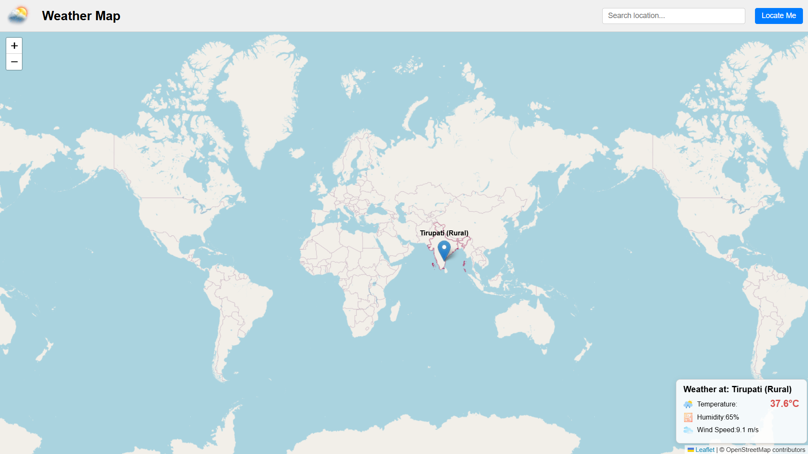

# 🌤️ Simple Weather Dashboard

[Live Demo 🌐](https://dheerajpapani.github.io/Simple-Weather-Dashboard/)

A lightweight interactive web app that shows real-time weather data on a map using Leaflet.js and OpenStreetMap.

## 🚀 Features

- 🔍 **Search Location**: Enter any place to view its weather data on the map.
- 📍 **Auto-Locate**: Click "Locate Me" to fetch weather data for your current location.
- 📌 **Dynamic Marker**: Places a marker with weather info when a location is selected.
- 📊 **Weather Details Displayed**:
  - Temperature (°C)
  - Humidity (%)
  - Wind Speed (m/s)

## 🛠️ Built With

- [Leaflet.js](https://leafletjs.com/) – Open-source JavaScript library for interactive maps  
- [OpenStreetMap](https://www.openstreetmap.org/) – Free editable map data  
- [OpenWeatherMap API](https://openweathermap.org/api) – Real-time weather data provider  
- HTML, CSS, JavaScript – Core web technologies

## 📷 Screenshot



> *Wadgaon weather example with auto-location marker and weather popup.*

## 📁 Folder Structure

Simple-Weather-Dashboard/
├── index.html
├── style.css
├── script.js
├── screenshot.png
└── README.md


## 🔑 API Key Note

This project uses the OpenWeatherMap API. To deploy your own version:
- Create a free API key from [OpenWeatherMap](https://openweathermap.org/api).
- Replace the placeholder in `script.js`:
  ``` js
  const apiKey = "YOUR_API_KEY_HERE"; ```
  

## 📦 Deployment

The project is deployed using **GitHub Pages**:
* Push your changes to `main` or `gh-pages` branch.
* Enable Pages in GitHub repo settings.


## 🧠 Future Enhancements

* Add 5-day or hourly forecasts
* Weather layers (temperature map, wind speed overlay)
* Responsive layout improvements


## 📄 License

MIT License – free to use and modify.
